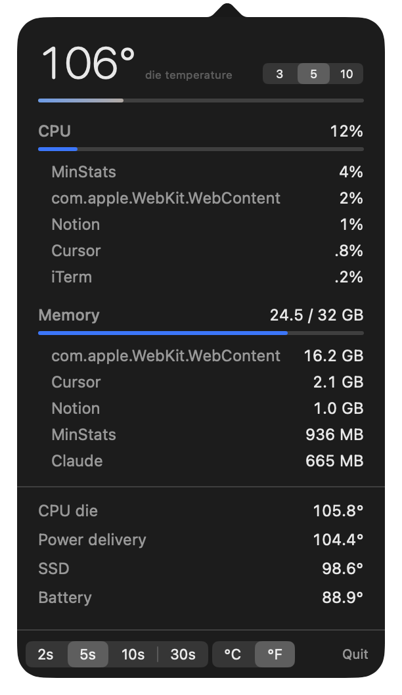

# MinStats

A minimalist macOS menu bar system monitor — and a secure companion app to watch (and lightly control) your Macs from your iPhone.

<p align="center">
  
</p>

Most system monitors show you everything. **MinStats shows you the vital few — temperature, CPU, RAM — beautifully**, and nothing you'll never read. It started as a menu bar app because I couldn't find an elegant one. It grew a phone companion because I wanted the same glance after I walked away from the machine.

Built with **zero third-party dependencies** — everything comes from the platform (IOKit, Network.framework, CryptoKit, SwiftUI). The Mac app builds with just the Command Line Tools; no Xcode required.

---

## Two parts, one design language

| | **MinStats** (macOS) | **MinStats** (iOS companion) |
|---|---|---|
| Lives in | the menu bar (no Dock icon, no window) | your pocket |
| Shows | temperature · CPU · RAM · top processes · fans | the same, for every paired Mac |
| Also does | launch at login, °C/°F, refresh rate | remotely quit an app, restart a Mac |
| Talks over | — | an HMAC-signed local API, discovered via Bonjour |

The iPhone can't read another Mac's sensors, so the menu bar app doubles as a tiny **agent**: it already samples everything and runs as you, so it serves that same sample to a paired phone over the local network — costing zero extra work.

## Highlights

**macOS app**
- **Headline die temperature** — the hottest CPU/SoC sensor, read via Apple's private IOHID API (no root)
- **Cold→hot gradient bar** — the temperature's position on a 20–100 °C scale, at a glance
- **Top processes** by CPU and by memory, grouped by app (Chrome's dozen helpers collapse to one line, with every PID tracked so "quit" quits the whole app)
- **Fan RPM** via the SMC, and a condensed 4-row sensor summary that hides absent hardware (no fan rows on a fanless Air; no battery row on a desktop mini)
- Compact / extended menu bar modes, °C/°F, 2/5/10/30 s refresh, launch at login (`SMAppService`)
- Universal binary (Apple Silicon + Intel), no Dock icon

**iOS companion**
- Discovers Macs on the network via Bonjour; pairs by scanning a QR (or pasting a link)
- A device list of all your Macs, each polling at the Mac's own cadence
- A detail screen that ports the Mac's visual language — same gradient bar, same process lists
- **Remote control**: quit a runaway app or request a restart, always behind a confirmation

## How it works

```
┌─────────────────── your Mac ───────────────────┐        ┌──── your iPhone ────┐
│  Samplers (IOKit / SMC / Mach)                  │        │                     │
│     ↓                                           │        │   Discovery (mDNS)  │
│  StatsModel  ──snapshot()──▶  Agent (NWListener)│◀──────▶│   StatsClient       │
│                               · Bonjour advert. │  HTTP  │   (HMAC-signs every │
│                               · HMAC verify     │  +HMAC │    request)         │
│                               · control (kill/  │        │   SwiftUI views     │
│                                 restart)        │        │                     │
└─────────────────────────────────────────────────┘        └─────────────────────┘
            shared wire contract: MinStatsProtocol (compiled into both)
```

- **Sensors.** Temperature comes from the private IOHID event-system API (the same approach Stats/macmon use — no public API exists). Fans come from the SMC over public IOKit. CPU/RAM use Mach kernel calls (`host_processor_info`, `host_statistics64`), with memory computed the way Activity Monitor's "Memory Used" is.
- **One source of truth.** The wire format lives in a shared `MinStatsProtocol` Swift package compiled into *both* the Mac agent and the iOS app — so the contract can't drift.
- **The agent serves the sample the menu bar already took**, so a polling phone adds no extra sampling cost.

## Security model

Because the phone can *control* the Mac (quit apps, request restart), auth is front-loaded, not bolted on:

- **Every request is HMAC-SHA256 signed** over `METHOD\nPATH\nTIMESTAMP\nNONCE\nSHA256(body)`. The shared secret **never crosses the wire** — signing survives a plaintext LAN. Pairing hands the phone the secret once, via a QR code.
- **Replay-protected**: a 60-second clock-skew window plus a 120-second nonce cache; the nonce is burned only *after* the signature validates.
- **Control is network-scoped in code**: `/control/*` is refused unless the peer is on a private address (RFC1918 / link-local / loopback / the `100.64.0.0/10` CGNAT range Tailscale uses). "Restart my Mac" is *unreachable from the public internet* regardless of how the network is configured.
- **Honest privilege limits**: everything runs unprivileged as the logged-in user. Killing your own apps works; root-owned processes return `denied` rather than escalating. Restart is a *request* (an app with unsaved work can veto it), so the agent never claims success — the Mac going offline is the confirmation. No privileged helper, by choice.
- **No cloud, no account, no telemetry.** Stats stay on your network.

## Build & run

**macOS** — needs only the Command Line Tools:
```sh
make run      # build, bundle, ad-hoc sign, relaunch dist/MinStats.app
make print    # dump one sample of everything to the terminal (no UI)
make serve    # run the agent headless — curl-testable without Xcode
make dmg      # universal installer at dist/MinStats.dmg
```

**iOS** — needs Xcode. See [`ios/SETUP.md`](ios/SETUP.md) for the full from-scratch guide (free Apple ID, physical device, and the gotchas that cost hours).

## Project layout

```
Sources/
  PrivateIOKit/        C shim for private IOHID + SMC symbols (IOKit-linked)
  MinStatsProtocol/    Codable wire DTOs — shared by both apps
  MinStats/
    Samplers/          Temperature, CPU, Memory, Process, Fan
    Agent/             StatsServer, Auth, HTTP, Control
    StatsModel · StatusBarController · DetailView · main
ios/MinStats/          the SwiftUI companion app
Support/               Info.plist, app icon + generator
```

## Status

**Working and verified on real hardware** — two Macs paired (a fanless M2 Air, an M4 mini with fans), stats and control live from the phone.

Deliberately deferred (with reasons, not laziness):
- **Remote access over the internet** — the agent already allows the Tailscale CGNAT range and pairs by hostname, so this is a near-codeless "install Tailscale" step rather than new code.
- **Push notifications** — needs a paid Apple Developer account, and the APNs key is team-wide, which would make the no-server design personal-use-only.
- **Distribution** — temperature uses private APIs, so the App Store is out (sandbox blocks them too). Ad-hoc signed today; Developer ID + notarization is the path.

## License

[MIT](LICENSE).
